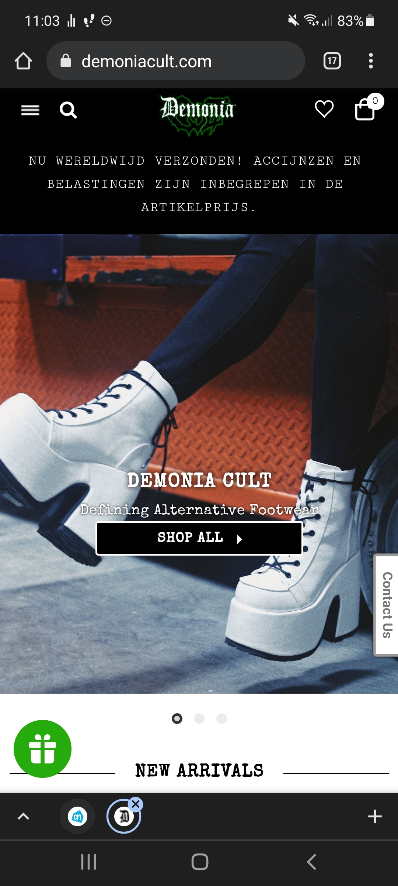
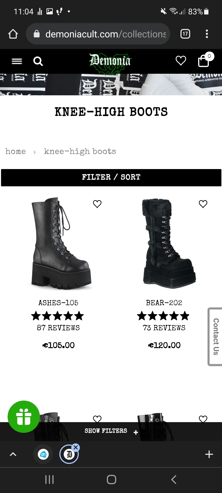
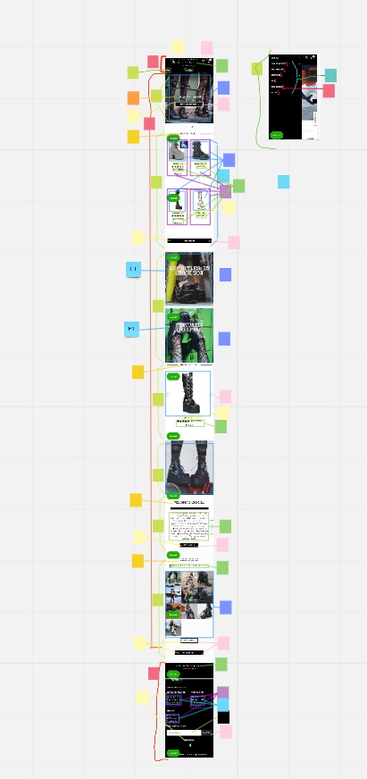
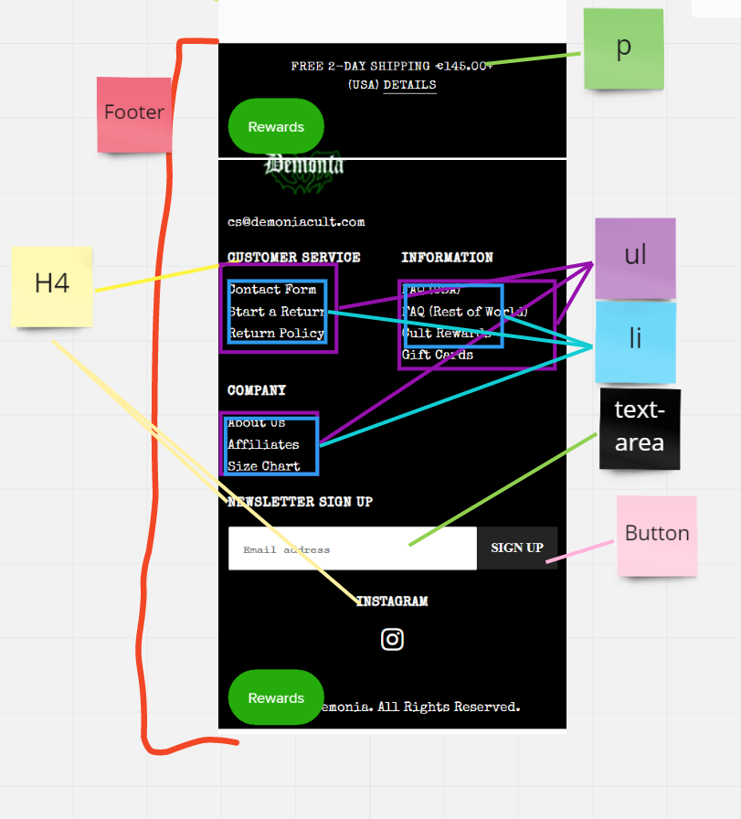
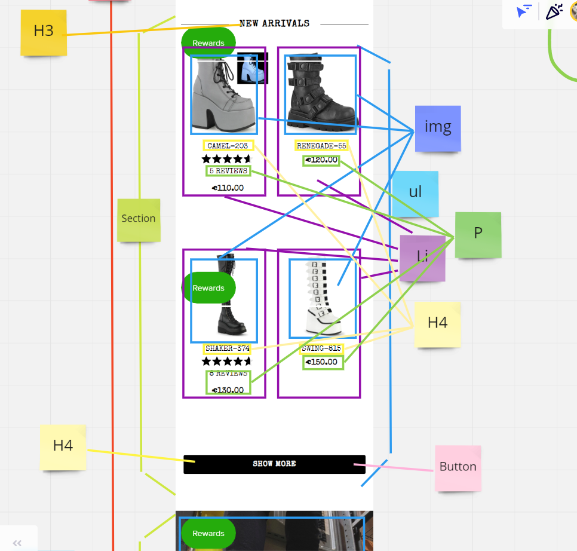
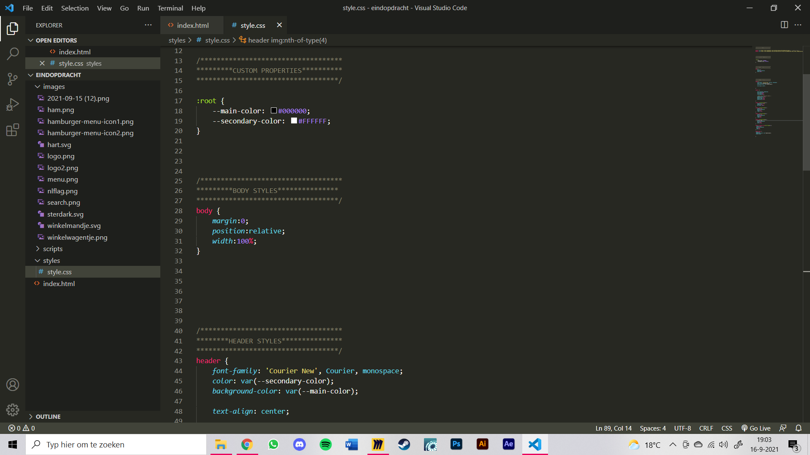
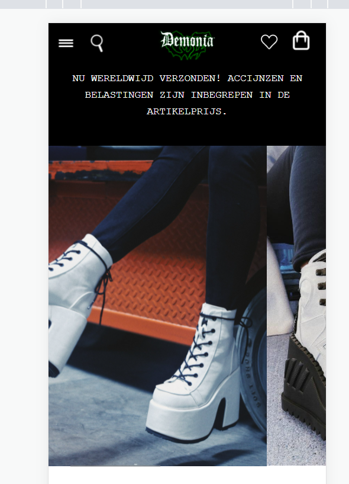
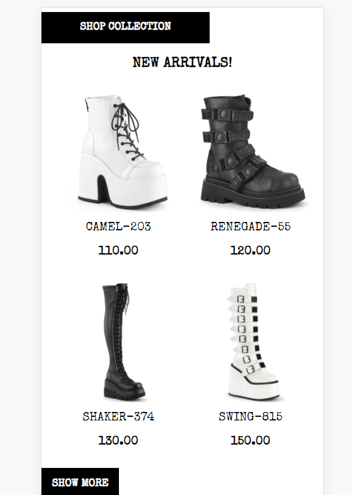

# Procesverslag
Markdown is een simpele manier om HTML te schrijven.  
Markdown cheat cheet: [Hulp bij het schrijven van Markdown](https://github.com/adam-p/markdown-here/wiki/Markdown-Cheatsheet).

Nb. De standaardstructuur en de spartaanse opmaak van de README.md zijn helemaal prima. Het gaat om de inhoud van je procesverslag. Besteedt de tijd voor pracht en praal aan je website.

Nb. Door *open* toe te voegen aan een *details* element kun je deze standaard open zetten. Fijn om dat steeds voor de relevante stuk(ken) te doen.

## Jij

uitwerken voor kick-off werkgroep

### Auteur:
Chelsey Bommer

#### Je startniveau:
Blauw

#### Je focus:
Responsive
 

## Je website

uitwerken voor kick-off werkgroep

### Je opdracht:
demoniacult.com

#### Screenshot(s) van de eerste pagina (small screen): 
Homepage

#### Screenshot(s) van de tweede pagina (small screen):
Producten pagina (deze verander ik later miss nog naar andere producten)

 

## Breakdownschets (week 1)

uitwerken na afloop 2e werkgroep

### de hele pagina: 

### dynamisch deel (bijv menu): 

### wellicht nog een dynamisch deel (bijv filter): 

## Voortgang 1 (week 2)

uitwerken voor 1e voortgang

### Stand van zaken
Ik vond door de breakdown schets het vrij makkelijk om de html te schrijven. De css ging daarna ook wel goed, maar ik moet nog
 erop letten dat ik die netjes houd. 
 Ik heb mijn css nu half netjes:
 

### Agenda voor meeting
samen met je groepje opstellen

 Wat ik wil vragen:
 -hoe zorg ik dat het niet meer inzoomt op grotere schermen?
 -is er nog iets niet kloppend etc

### Verslag van meeting
Uitkomsten van de meeting:

- We hebben opgelost dat de pagina niet meer inzoomde met width
- Ze vonden het verder prima

## Voortgang 2 (week 3)

uitwerken voor 2e voortgang

### Stand van zaken
Deze week ging ik verder met de slideshow, maar deze was heel lastig. Het is nog niet helemaal gelukt 
 deze te maken. Ik heb wel alle foto's naast elkaar waar je doorheen kan swipen, maar heb nog niet de transities uit zichzelf.
 
 
 
 Om wel verder te gaan was ik ook vast een grid met producten aan het maken, en de bijbehorende buttons. Dit ging wel goed.
 
 
 

### Agenda voor meeting
samen met je groepje opstellen

| Chelsey        | Maxime             | Jessica/Bilal/Thije      | Fabian           |
| ---            | ---                | ---                      | ---              |
|Slideshow maken?| Hamburger          | Voorgaande onderwerpen   | Images groter    |
|Hoe             | Menu               |                          | in verhouding blijven |
 gedetailleerd?  | ...                | ...                      | ...              |

### Verslag van meeting
hier na afloop snel de uitkomsten van de meeting vastleggen

- We hebben slideshow samen gemaakt, waar ik nog wel wat uit kan halen. 
    https://codepen.io/chelsey-bommer/pen/vYZzQMp?editors=1100
 -Qua strengheid laten zien wat je kan met code 

## Toegankelijkheidstest (week 4)

uitwerken na test in 8e voortgang

### Bevindingen
Lijst met je bevindingen die in de test naar voren kwamen:

#### Titel eerste bevinding
Hier korte omschrijving (met indien nodig een afbeelding)

Hier een omschrijving van hoe het opgelost kan worden (met indien nodig een afbeelding)

#### Titel tweede bevinding. 
Hier korte omschrijving (met indien nodig een afbeelding)

Hier een omschrijving van hoe het opgelost kan worden (met indien nodig een afbeelding)

#### Titel volgende bevinding. 
Hier korte omschrijving (met indien nodig een afbeelding)

Hier een omschrijving van hoe het opgelost kan worden (met indien nodig een afbeelding)

#### Titel nog een bevinding. 
Hier korte omschrijving (met indien nodig een afbeelding)

Hier een omschrijving van hoe het opgelost kan worden (met indien nodig een afbeelding)

## Voortgang 3 (week 4)

uitwerken voor 3e voortgang

### Stand van zaken
hier dit ging goed & dit was lastig (neem ook screenshots op van delen van je website en code)

### Agenda voor meeting
samen met je groepje opstellen

| student 1      | student 2          | student 3    | student 4        |
| ---            | ---                | ---          | ---              |
| dit bespreken  | en dit             | en ik dit    | en dan ik dat    |
| en dat ook nog | dit als er tijd is | nog een punt | dit wil ik zeker |
| ...            | ...                | ...          | ...              |

### Verslag van meeting
hier na afloop snel de uitkomsten van de meeting vastleggen

- punt 1
- punt 2
- nog een punt
- ...

## Eindgesprek (week 5)

uitwerken voor eindgesprek

### Stand van zaken
hier dit ging goed & dit was lastig (neem ook screenshots op van delen van je website en code)

### Screenshot(s)

hier screenshot(s) van je eindresultaat

## Bronnenlijst

continu bijhouden terwijl je werkt

Nb. Wees specifiek ('css-tricks' als bron is bijv. niet specifiek genoeg).

1. Sanne: https://www.sinds1971.nl/fed/bolletjes/ https://codepen.io/shooft/pen/oNzGJMM Slideshow
2. Font Special Elite: https://fonts.google.com/specimen/Special+Elite
3. Font Courier: https://fonts.google.com/specimen/Courier+Prime?query=couri#standard-styles
4.  Flex-shirnk:  https://cssreference.io/property/flex-shrink/

