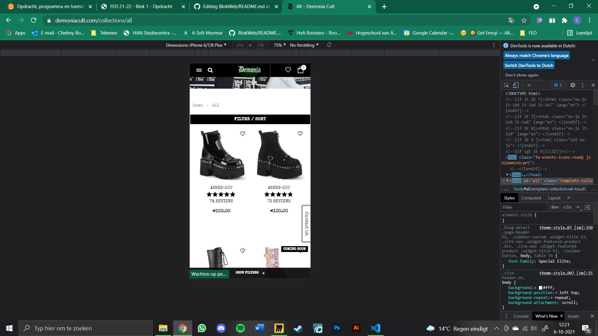
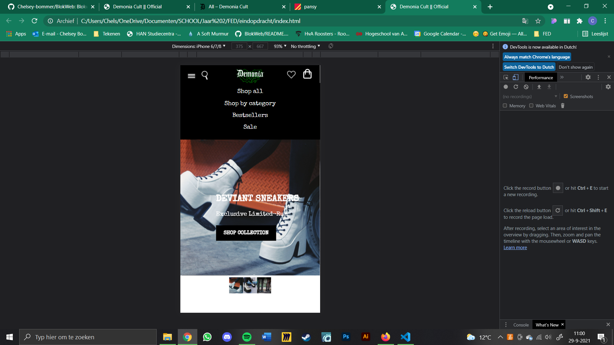
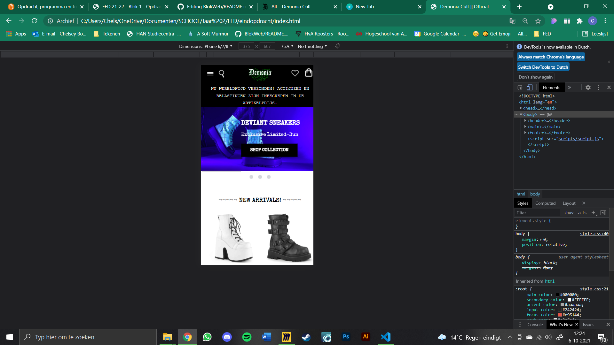
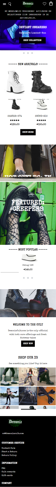
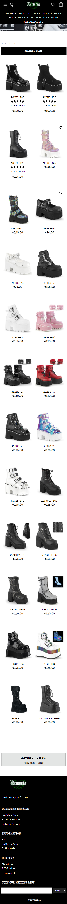

# Procesverslag
Markdown is een simpele manier om HTML te schrijven.  
Markdown cheat cheet: [Hulp bij het schrijven van Markdown](https://github.com/adam-p/markdown-here/wiki/Markdown-Cheatsheet).

Nb. De standaardstructuur en de spartaanse opmaak van de README.md zijn helemaal prima. Het gaat om de inhoud van je procesverslag. Besteedt de tijd voor pracht en praal aan je website.

Nb. Door *open* toe te voegen aan een *details* element kun je deze standaard open zetten. Fijn om dat steeds voor de relevante stuk(ken) te doen.

## Jij

uitwerken voor kick-off werkgroep

### Auteur:
Chelsey Bommer

#### Je startniveau:
Blauw

#### Je focus:
Responsive
 

## Je website

uitwerken voor kick-off werkgroep

### Je opdracht:
demoniacult.com

#### Screenshot(s) van de eerste pagina (small screen): 
Homepage
 

#### Screenshot(s) van de tweede pagina (small screen):
Producten pagina 

 

## Breakdownschets (week 1)

uitwerken na afloop 2e werkgroep

### de hele pagina: 

### dynamisch deel (bijv menu): 

### wellicht nog een dynamisch deel (bijv filter): 

## Voortgang 1 (week 2)

uitwerken voor 1e voortgang

### Stand van zaken
Ik vond door de breakdown schets het vrij makkelijk om de html te schrijven. De css ging daarna ook wel goed, maar ik moet nog
 erop letten dat ik die netjes houd. 
 Ik heb mijn css nu half netjes:
 

### Agenda voor meeting
samen met je groepje opstellen

 Wat ik wil vragen:
 -hoe zorg ik dat het niet meer inzoomt op grotere schermen?
 -is er nog iets niet kloppend etc

### Verslag van meeting
Uitkomsten van de meeting:

- We hebben opgelost dat de pagina niet meer inzoomde met width
- Ze vonden het verder prima

## Voortgang 2 (week 3)

uitwerken voor 2e voortgang

### Stand van zaken
Deze week ging ik verder met de slideshow, maar deze was heel lastig. Het is nog niet helemaal gelukt 
 deze te maken. Ik heb wel alle foto's naast elkaar waar je doorheen kan swipen, maar heb nog niet de transities uit zichzelf.
 
 
 
 Om wel verder te gaan was ik ook vast een grid met producten aan het maken, en de bijbehorende buttons. Dit ging wel goed.
 
 
 

### Agenda voor meeting
samen met je groepje opstellen

| Chelsey        | Maxime             | Jessica/Bilal/Thije      | Fabian           |
| ---            | ---                | ---                      | ---              |
|Slideshow maken?| Hamburger          | Voorgaande onderwerpen   | Images groter    |
|Hoe             | Menu               |                          | in verhouding blijven |
 gedetailleerd?  | ...                | ...                      | ...              |

### Verslag van meeting
hier na afloop snel de uitkomsten van de meeting vastleggen

- We hebben slideshow samen gemaakt, waar ik nog wel wat uit kan halen. 
    https://codepen.io/chelsey-bommer/pen/vYZzQMp?editors=1100
 -Qua strengheid laten zien wat je kan met code 

## Toegankelijkheidstest (week 4)

uitwerken na test in 8e voortgang

### Bevindingen
-Voeg altijd Alts toe (narrator)
-Wanneer je een hamburger menu hebt, wordt deze opgenoemt (narrator)
-Wanneer je 2 talen hebt is het onhandig (narrator)
-Ik moet nog states toevoegen
-In chrome krijg je extra scrollbalken

#### Alts toevoegen
Wanneer je geen Alts toevoegd zegt de narrator niet wat je moet zien. Ik had dit nog niet overal gedaan
 (wel op sommige plekken). 

 Oplossing: Voeg omschrijvingen toe aan de alt.

#### Hamburger menu narrator
Wanneer je een verborgen menu hebt word deze ook opgelezen door de narrator.

 Sanne zei dat dit moeilijk was om op te lossen, dus dat dit niet hoefde. Alleen als je advanced bent.

#### 2 talen onhandig 
Wanneer je meer dan 1 taal hebt in je website wordt 1 van de 2 slecht opgelezen. Dit komt doordat je
 de narrator altijd in een vaste taal zet.

Oplossing: Gebruik maar 1 taal, als dit lukt. De site die ik namaak heeft wel allebei, dus ik doe dit ook. 

#### States
Ik had nog heel weinig states toegevoegd.

Oplossing: Voeg alle states toe.
 
 
#### Scrollbalken 
In chrome als je je website op responsive zet, krijg je soms vage extra scrollbalken op je website.

Oplossing: gebruikt geen Chrome, of zet hem op een vast formaat.

## Voortgang 3 (week 4)

uitwerken voor 3e voortgang

### Stand van zaken
Door de hulp van Rowin heb ik mijn slideshow en hamburgermenu af kunnen maken.
 
  

### Agenda voor meeting
samen met je groepje opstellen

| Chelsey        | student 2          | student 3    | student 4        |
| ---            | ---                | ---          | ---              |
| Geen vragen    | en dit             | en ik dit    | en dan ik dat    |
|                | dit als er tijd is | nog een punt | dit wil ik zeker |
| ...            | ...                | ...          | ...              |

### Verslag van meeting
hier na afloop snel de uitkomsten van de meeting vastleggen

- Ik heb mijn website laten zien aan Rowin.
-Ik vroeg nog of het hoort dat je een stukje naar beneden gaat bij de slideshow, maar dit kon je niet veranderen dus. 

## Eindgesprek (week 5)

uitwerken voor eindgesprek

### Stand van zaken
Het uiterlijk van de mobiele versies ging erg goed, daar ben ik trots op. Ook dat
 ik het menu van de ipad weer anders heb gekregen ben ik blij mee.
 
 
 
 Wat niet helemaal wilde lukken is de focus state bij alle elementen. Deze staan er door tijd gebrek
 niet goed bij alle images.
 

### Screenshot(s)

 

## Bronnenlijst

continu bijhouden terwijl je werkt

Nb. Wees specifiek ('css-tricks' als bron is bijv. niet specifiek genoeg).

1. Sanne: https://www.sinds1971.nl/fed/bolletjes/ https://codepen.io/shooft/pen/oNzGJMM Slideshow
2. Font Special Elite: https://fonts.google.com/specimen/Special+Elite
3. Font Courier: https://fonts.google.com/specimen/Courier+Prime?query=couri#standard-styles
4.  Flex-shirnk:  https://cssreference.io/property/flex-shrink/
5.  Flex-wrap: https://css-tricks.com/almanac/properties/f/flex-wrap/ 

